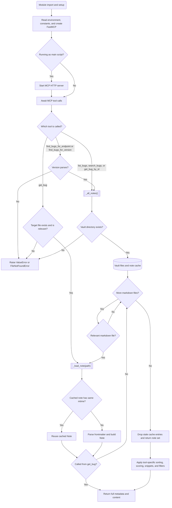

# Bug Tracker MCP Server

## Summary

An MCP Server that leverages notes written in Markdown to track bugs.  The server was written for those
developing Cisco Nexus Dashboard applications which use the REST API, but could easily be
leveraged for other uses.

My use case is providing Claude Code with a resource through which it can determine the
suitability of various Nexus Dashboard endpoints for a given task, and whether an endpoint exhibits
any behavioral bugs and, if so, what version(s) exhibit the behavior and what
version (if any) fixes the behavior.  Notes might also contain workaround(s).

**The actual notes are not included in this repository.**

## Setup

### 1. Install Obsidian and login

### 2. Setup sync with the ND Vault (vault should be in `$HOME/Obsidian/ND`)

### 3. Install the LaunchDaemon

The server runs as a system LaunchDaemon, so it starts at boot without anyone
logging in. The `UserName` key makes it run as your account, not as root. (The
vault itself only stays current while Obsidian is running in a login session.)

`com.bug-tracker-mcp.plist` in this repository is a template. Two placeholders
must be replaced before it is installed:

| Placeholder     | Replace with                                                   |
| --------------- | -------------------------------------------------------------- |
| `YOUR_USERNAME` | The account the server runs as (`id -un`)                      |
| `YOUR_TMPDIR`   | That account's temp directory (`getconf DARWIN_USER_TEMP_DIR`) |

The template also assumes the following. Edit the file if your host differs:

- This repository is at `/Users/YOUR_USERNAME/repos/mcp/bug-tracker-mcp`
  (`ProgramArguments` and `WorkingDirectory`).
- `uv` is installed inside the project's virtual environment, at `.venv/bin/uv`.
  If your `uv` lives elsewhere, use the path printed by `command -v uv` as the
  first `ProgramArguments` entry.
- The vault is at `/Users/YOUR_USERNAME/Obsidian/ND` (`OBSIDIAN_VAULT_PATH`).
- The account's primary group is `staff` (`GroupName`; check with `id -gn`).

Run the following as the account the server should run as. It fills in the
placeholders, installs the result, and starts the server:

```bash
cd $HOME/repos/mcp/bug-tracker-mcp
mkdir -p $HOME/Library/Logs/mcp
sed -e "s|YOUR_USERNAME|$(id -un)|g" \
    -e "s|YOUR_TMPDIR|$(getconf DARWIN_USER_TEMP_DIR)|" \
    com.bug-tracker-mcp.plist \
    | sudo tee /Library/LaunchDaemons/com.bug-tracker-mcp.plist > /dev/null
sudo chown root:wheel /Library/LaunchDaemons/com.bug-tracker-mcp.plist
sudo chmod 644 /Library/LaunchDaemons/com.bug-tracker-mcp.plist
plutil -lint /Library/LaunchDaemons/com.bug-tracker-mcp.plist
sudo launchctl bootstrap system /Library/LaunchDaemons/com.bug-tracker-mcp.plist
```

launchd will not load a LaunchDaemon plist unless it is owned by `root` and not
writable by group or others, hence the `chown` and `chmod`.

If you previously installed the server as a LaunchAgent, remove that first.
Otherwise both copies compete for port 8001:

```bash
launchctl bootout gui/$(id -u)/com.bug-tracker-mcp
rm $HOME/Library/LaunchAgents/com.bug-tracker-mcp.plist
```

### 4. Check, restart, and update the server

Check that it is running, and read its log:

```bash
launchctl print system/com.bug-tracker-mcp | grep -E '^\s(state|pid|last exit code) '
tail $HOME/Library/Logs/mcp/bug-tracker-mcp.err.log
```

Restart it:

```bash
sudo launchctl kickstart -k system/com.bug-tracker-mcp
```

Without `sudo`, stop the process instead. It runs as your account, and
`KeepAlive` makes launchd start it again within a few seconds:

```bash
kill $(launchctl print system/com.bug-tracker-mcp | awk '/^\tpid = /{print $3}')
```

Edits to the vault are picked up without a restart, but changes to `server.py`
are not. After a `git pull`, restart the server.

A restart does not re-read the plist. To change the installed plist, or to
uninstall, unload it first (then repeat the install commands if reinstalling):

```bash
sudo launchctl bootout system/com.bug-tracker-mcp
sudo rm /Library/LaunchDaemons/com.bug-tracker-mcp.plist
```

### 5. Edit Claude Code's config on the client Mac to point to this MCP server

- edit $HOME/.claude.json
- Search for the `mcpServers` block
- Add the following (where `mm1e` is the hostname or IP address of the Mac that's hosting the MCP server)

```json
  "mcpServers": {
    "bug-tracker-mcp": {
      "type": "http",
      "url": "http://mm1e:8001/mcp"
    }
  }
```

### 6. Restart Claude Code and check the MCP server status using the `/mcp` slash command

## MCP Server Logic Diagram


